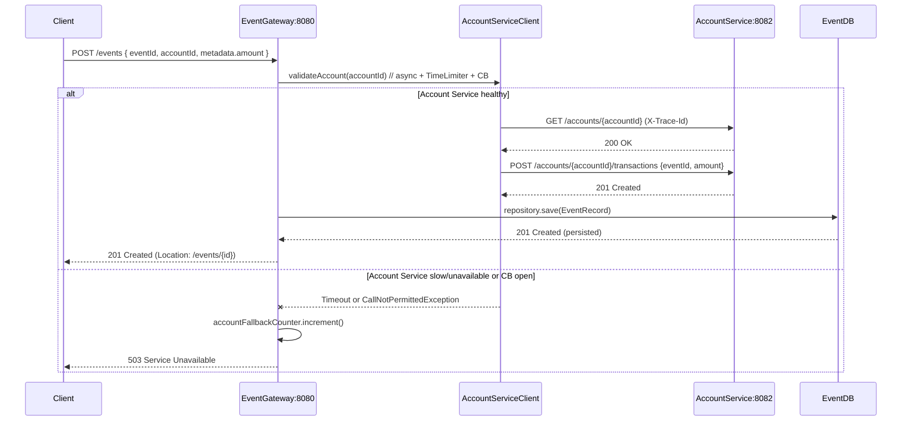

# Event Gateway & Account Service — Low-level Diagrams

This file contains low-level diagrams (Mermaid and ASCII fallbacks) for the Event Gateway and the Account Service. You can paste the Mermaid blocks into any Markdown viewer that supports Mermaid (or an online renderer) to see rendered diagrams.

---

## Checklist (what's included)
- Component diagram (Mermaid + ASCII fallback)
- Sequence diagram for POST /events (Mermaid + ASCII fallback)
- File/component mapping (where to find code in the workspace)
- Quick notes on rendering and how to produce PNGs locally

---

## Component diagram (Mermaid)

```mermaid
graph TD
  subgraph Client
    C[Client (UI / curl / Postman)]
  end

  subgraph "Event Gateway (port 8080)"
    EG_API[EventRecordController\n(/events)]
    EG_SERVICE[AccountServiceClient\n(RestTemplate, Resilience4j, TimeLimiter)]
    EG_REPO[EventRecordRepository\n(JPA, repository)]
    EG_ENTITY[EventRecord entity\nMapToJsonConverter]
    EG_RESTCFG[RestConfig\n@RestTemplate bean]
    EG_TRACING[TracingConfig\nX-Trace-Id filter + RestTemplate interceptor]
    EG_LOGGING[logback-spring.xml\nJSON logs (traceId)]
    EG_METRICS[Micrometer (Prometheus)\nCounter: events.accountService.fallback]
    EG_DB[(H2: jdbc:h2:mem:eventdb)]
  end

  subgraph "Account Service (port 8082)"
    AS_API[TransactionController\n(/accounts/{id}, /transactions)]
    AS_SERVICE[TransactionService\n(business logic)]
    AS_REPO[AccountRepository, AppliedTransactionRepository]
    AS_ENTITY[Account, AppliedTransaction entities]
    AS_DB[(H2: jdbc:h2:mem:testdb)]
    AS_H2CONSOLE[H2 Console]
  end

  subgraph Infra
    PROM[Prometheus (scrapes /actuator/prometheus)]
  end

  %% Connections
  C -->|HTTP POST /events| EG_API
  EG_API -->|calls validateAccount()| EG_SERVICE
  EG_SERVICE -->|GET /accounts/{id} (propagate X-Trace-Id)| AS_API
  EG_SERVICE -->|POST /accounts/{id}/transactions\n(eventId, amount)| AS_API
  EG_SERVICE -- Resilience4j (TimeLimiter / CB) --> EG_API
  EG_API --> EG_REPO
  EG_REPO --> EG_DB
  AS_API --> AS_SERVICE
  AS_SERVICE --> AS_REPO
  AS_REPO --> AS_DB
  EG_TRACING --> EG_RESTCFG
  EG_RESTCFG --> EG_SERVICE
  EG_LOGGING --> EG_API
  EG_METRICS --> PROM
  AS_API -->|/h2-console| AS_H2CONSOLE
```

Notes:
- Gateway code locations (examples):
  - `src/main/java/com/charlesschwab/eventGateway/controller/EventRecordController.java`
  - `src/main/java/com/charlesschwab/eventGateway/service/AccountServiceClient.java`
  - `src/main/java/com/charlesschwab/eventGateway/config/TracingConfig.java`
  - `src/main/java/com/charlesschwab/eventGateway/repository/EventRecordRepository.java`
  - `src/main/java/com/charlesschwab/eventGateway/model/EventRecord.java`
  - `src/main/resources/application.properties` (account.service.url)
  - `src/main/resources/logback-spring.xml` (JSON logging)
- Account Service JAR if present: `src/main/resources/accountService-0.0.1-SNAPSHOT.jar` (embedded controller at `BOOT-INF/classes/.../TransactionController.class`).

---

## Sequence diagram — POST /events (Mermaid)



---

## ASCII fallback (if Mermaid cannot be rendered)

Component overview (ASCII)

- Client -> Event Gateway (8080)
  - EventGateway
    - EventRecordController (/events)
    - AccountServiceClient (RestTemplate + Resilience4j TimeLimiter + CircuitBreaker)
    - RestTemplate bean (tracing interceptor)
    - EventRecordRepository (JPA) -> H2 jdbc:h2:mem:eventdb
    - Logging: logback JSON with traceId
    - Metrics: Micrometer counter events.accountService.fallback -> /actuator/prometheus
- Account Service (8082)
  - TransactionController (/accounts/{id}, /transactions)
  - TransactionService
  - Repositories -> H2 jdbc:h2:mem:testdb

Sequence (success)

1. Client POST -> EventGateway (/events)
2. EventGateway -> AccountServiceClient.validate -> GET /accounts/{id} (propagate X-Trace-Id)
3. Account Service responds 200 OK
4. EventGateway -> AccountServiceClient.applyTransaction -> POST /accounts/{id}/transactions (eventId, amount)
5. Account Service responds 201 Created -> gateway persists EventRecord in its H2 -> returns 201 to client

Sequence (fallback)

- If GET/POST to Account Service times out or circuit is open -> Resilience4j fallback -> gateway increments `events.accountService.fallback` and returns 503 (no local persist)

